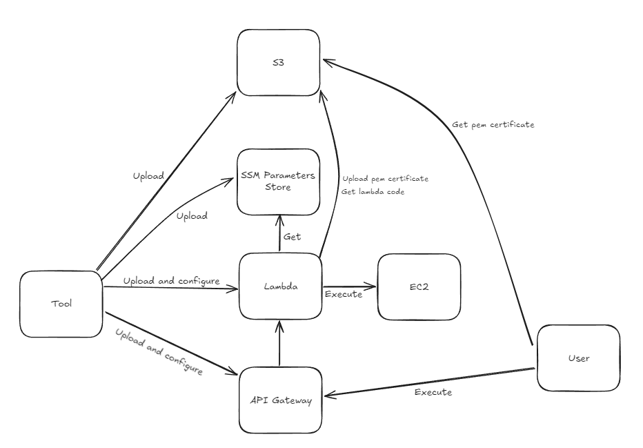

<h2>How this solution meets requirements</h2>
Tool is operating on AWS via Boto3 library. 
It is preparing AWS services and in the final step lambdas are uploaded and user is able to invoke requrests 
Each lambda function is connected to API Gateway endpoint with proper and specified models (models are defined in <b>src/utils/constants.py</b>)
<h4>Advantages:</h4>
<ul>
<li>Proces is mostly automated - only roles/user creation and local environment is not</li>
<li>Log are stored for both flow and library (setuper.log and root.log will be created after app start)</li>
</ul>
<h4>Disadvantages of current implementation:</h4>
<ul>
<li>Process itself is not reversible after partial failure - it means tool can handle and inform about exception but it cannot rollback previous actions</li>
</ul>

Results: 
Four lambda functions will be deployed on AWS Lambda service 
API Gateway will be created with root path provided by user in config file 
Each lambda function will be individually connected to endpoint 

Endpoints specification: 
1. <h5>create-EC2 (POST <b>/create-EC2</b>) - this endpoints allows user to create (run) EC2 instance</h5>
   Request body 
   <pre>
   {
     'instanceName': 'my-test-ec2-instance', 
     'instanceType': 't1.micro', 
     'keyPairName': 'superSecretKeyPair', 
     'imageId': 'ami-00385a401487aefa4'
   }
   </pre>
    - instanceName = Just a string name of instance
    - instanceType = Type of instance (e.g t1.micro)
    - keyPairName = Name of a key that should be use for SSH connection (tool will make a pem certificate and upload it on s3)
    - imageId = Image Id  
    Response
   <pre>
   {
     "user_name": "ec2-user", 
     "ssh_pem": {
       "bucket": "your-super-backet-name-pems", 
       "object": "best-security-instance-key.pem"
     }, 
     "instanceId": "i-04bf5494f410d06a3"
   }
   </pre>
   - user_name = Contains a linux user name 
   - ssh_pem = Contains name of S3 bucket and object name of pem certificate 
2. <h5>start-EC2 (POST <b>/start-EC2</b>) - this endpoints allows user to start EC2 instance</h5>
    Request body 
   <pre>
   {
     'instanceId': 'i-04bf5494f410d06a3'
   }
   </pre>
    - instanceId = instance id 
    Response
   <pre>
   {}
   </pre>
3. <h5>stop-EC2 (POST <b>/stop-EC2</b>) - this endpoints allows user to stop EC2 instance</h5>
4. Request body 
   <pre>
   {
     'instanceId': 'i-04bf5494f410d06a3'
   }
   </pre>
   - instanceId = instance id
    Response
   <pre>
   {}
   </pre>
4. <h5>delete-EC2 (POST <b>/delete-EC2</b>) - this endpoints allows user to terminate EC2 instance</h5>
    Request body 
   <pre>
   {
     'instanceId': 'i-04bf5494f410d06a3'
   }
   </pre>
   - instanceId = instance id
    Response
   <pre>
   {}
   </pre>

<h3>Overall concept diagram:</h3>

<h5>Tool design</h5>
 - tool has very simple design of basically two files (main.py, flow.py)
 - main.py is a core file to run program. 
 - flow.py contains the declarations of steps
 - *_adapter.py files are just adapting usage of boto3 library of each AWS service
 - lambdas directory contains each lambda function code

<h5>How to use this tool</h5>

AWS User that is going to execute this program should have those permissions (policy names):
- AWSLambda_FullAccess
- AmazonSSMFullAccess
- AmazonS3FullAccess
- AmazonAPIGatewayAdministrator

For AWS Lambda the role with name <b>lambda-execution-manual</b> is required with permissions listed below:
- AmazonEC2FullAccess
- AmazonS3FullAccess
- AmazonSSMReadOnlyAccess
- AWSLambdaExecute

To run script At Least Python 3.10.0 is required
1. Setup your AWS CLI to be accessible and have right user 
2. install PIP dependencies (by pip install -r requirements.txt )
3. configure file app.cfg
4. start program (python main.py)
5. play with created API
6. *example usage of API has been shown in src/utils/post_request.py

